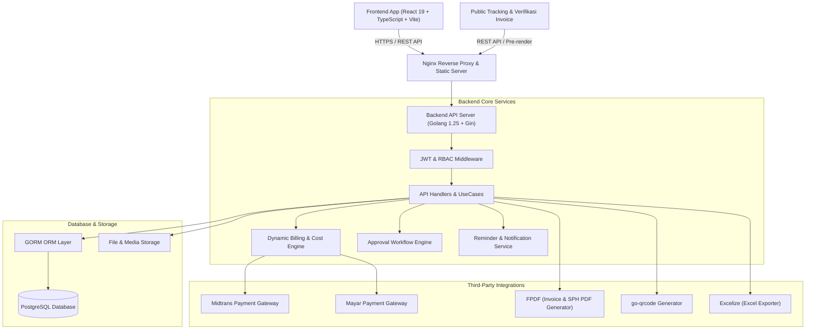
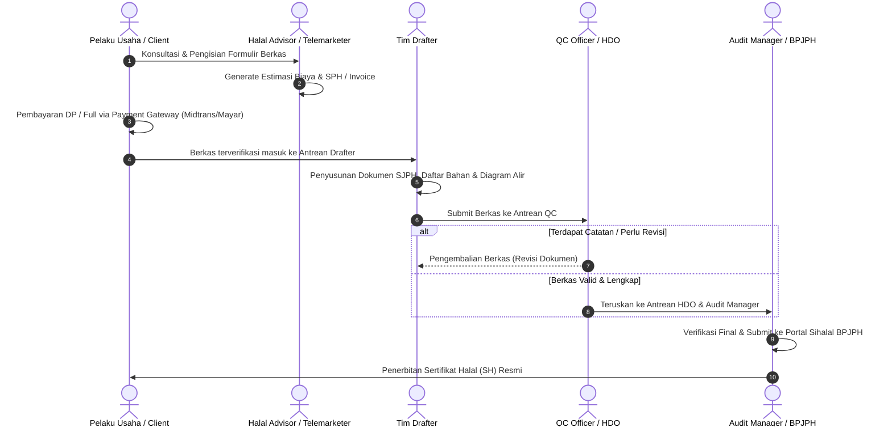

# 📖 DOKUMENTASI PROYEK ANA NAHNU
### *Integrated Halal Certification Ecosystem & Operational Management Platform*

---

## 📑 DAFTAR ISI
1. [Overview Project](#1-overview-project)
2. [Fitur-Fitur Utama & Modul Sistem](#2-fitur-fitur-utama--modul-sistem)
3. [Teknologi yang Digunakan (Tech Stack)](#3-teknologi-yang-digunakan-tech-stack)
4. [Diagram Arsitektur & Alur Kerja](#4-diagram-arsitektur--alur-kerja)
5. [Durasi & Linimasa Pengerjaan (Timeline)](#5-durasi--linimasa-pengerjaan-timeline)
6. [Struktur Hak Akses & Peran Pengguna (RBAC)](#6-struktur-hak-akses--peran-pengguna-rbac)
7. [Gambar Hasil & Visualisasi Antarmuka](#7-gambar-hasil--visualisasi-antarmuka)
8. [Panduan Menjalankan Aplikasi](#8-panduan-menjalankan-aplikasi)

---

## 1. 🌟 Overview Project

**Ana Nahnu** adalah platform ekosistem digital terpadu yang dirancang khusus untuk mengelola, mempercepat, dan mengotomatisasi seluruh siklus pendampingan dan **Sertifikasi Halal** (jalur **Reguler** maupun **Self-Declare**) di Indonesia sesuai standar BPJPH (*Badan Penyelenggara Jaminan Produk Halal*) dan LPH (*Lembaga Pemeriksa Halal*).

Platform ini menghubungkan berbagai stakeholder dalam satu ekosistem terintegrasi: Pelaku Usaha (Klien/UMKM/Korporat), Telemarketing, Halal Advisor (Konsultan Pendamping), Drafter Dokumen SJPH, Tim Quality Control (QC), Halal Document Officer (HDO), Audit Manager, Tim Keuangan (Finance), Business Development (BizDev), hingga Eksekutif (Halal Director).

### 🎯 Tujuan & Manfaat Utama
* **Digitalisasi Alur Sertifikasi**: Menggantikan berkas manual yang tercecer dengan sistem formulir dinamis berjenjang (*dynamic multi-step wizard*) dan pelacakan status transparan.
* **Otomasi Kalkulasi Biaya Multi-Parameter**: Menghitung estimasi biaya konsultasi secara otomatis berdasarkan skala usaha, kategori produk, komponen biaya per wilayah/geografis, serta skema pembayaran.
* **Invoicing & Pembayaran Multi-Channel**: Integrasi otomatis dengan *Payment Gateway* (Midtrans & Mayar), verifikasi bukti bayar manual, dan penerbitan invoice resmi berstempel QR Code.
* **Distribusi Tugas & Command Center Operasional**: Pengaturan antrean drafting berkas teknis, evaluasi QC, audit berkas, hingga pemantauan produktivitas tim secara *real-time*.
* **Manajemen Jaringan & Skema Komisi Berjenjang**: Perhitungan komisi penjualan langsung (*Direct Sales*), komisi referral, dan komisi struktural (*Monthly Override*) secara transparan.

---

## 2. 🚀 Fitur-Fitur Utama & Modul Sistem

Sistem Ana Nahnu terdiri dari modul-modul komprehensif berikut:

### A. Modul Pengajuan Sertifikasi (Submissions & Dynamic Forms)
1. **Dynamic Form Configurator**: Administrator dapat mengatur kolom formulir (label, tipe input, wajib/opsional, urutan step) tanpa perlu mengubah kode sumber. Mendukung tipe input: *text, number, file upload, date, repeater, foto kegiatan, susunan tim halal, dan matriks bahan*.
2. **Jalur Reguler & Self-Declare**: Alur khusus untuk sertifikasi reguler (usaha menengah/besar/fasilitasi) dan self-declare (usaha mikro/kecil).
3. **Pengunggahan & Validasi Berkas**: Kelengkapan NIB, KTP Penanggung Jawab, Foto Produk, Foto Pabrik/Dapur, Manual SJPH, dan Sertifikat Pelatihan Penyelia Halal.
4. **Sistem Catatan & Revisi Berkas**: Komunikasi catatan perbaikan dua arah antara pemeriksa dokumen (Drafter/QC) dengan Klien atau Advisor.

### B. Modul Billing, Invoicing & Payment Gateway
1. **Kalkulator Estimasi Biaya Dinamis**: Menghitung biaya pengajuan secara instan dengan parameter:
   * Skala Usaha (Mikro, Kecil, Menengah, Besar)
   * Kategori Produk & Jumlah Varian/Menu
   * Komponen Biaya Wilayah (Provinsi & Kabupaten/Kota)
   * Opsi Pembayaran: **Down Payment (DP %)** atau **Pembayaran Penuh (Full Payment)**
2. **Integrasi Payment Gateway**:
   * **Midtrans**: Virtual Account (BCA, Mandiri, BNI, BRI, Permata), QRIS (GoPay, ShopeePay, dsb).
   * **Mayar**: Alternatif payment gateway instan dengan webhook notifikasi otomatis.
3. **Penerbitan Invoice & Surat Perjanjian Digital**:
   * Invoice berformat PDF otomatis dilengkapi QR Code keaslian dokumen.
   * Verifikasi dokumen terbuka via tautan `/verify-invoice/:id` dan `/verify/agreement/:id/:token`.

### C. Modul Manajer Operasional (Command Center)
1. **Dashboard Eksekutif Operasional**: Statistik total pengajuan masuk, proses drafting, antrean QC, antrean HDO, dan sertifikat terbit.
2. **Antrean QC (Quality Control)**: Filter prioritas untuk verifikasi kelayakan dokumen teknis sebelum masuk ke sistem Sihalal BPJPH.
3. **Antrean HDO (Halal Document Officer)**: Pengawasan berkas yang telah melewati verifikasi QC untuk penyiapan submit ke LPH/BPJPH.
4. **Manajemen Audit & Audit Trail**: Pencatatan riwayat setiap aksi user (*who, what, when, IP Address*) untuk kepatuhan tata kelola.
5. **Sistem Reminder & Notifikasi**: Pengingat pengajuan yang tertunda (*idle submissions*) dan notifikasi status via in-app & email.

### D. Modul Komisi, Referral & Jaringan Konsultan
1. **Struktur Hirarki Konsultan**: Hirarki 3 tingkat (*Director $\rightarrow$ Halal Manager $\rightarrow$ Halal Advisor*).
2. **Kalkulasi Komisi Multi-Tipe**:
   * **Direct Sales Commission**: Diberikan kepada Advisor yang merekrut klien secara langsung.
   * **Referral Commission**: Diberikan kepada konsultan yang mereferensikan konsultan baru.
   * **Structural Override Commission**: Diberikan kepada Halal Manager atas performa total tim binaannya.
3. **Dashboard Penarikan & Rekapitulasi Komisi**: Manajemen status pencairan dana (*Pending, Approved, Paid*).

### E. Modul Business Development (BizDev) & Finance
1. **Pembuat SPH (Surat Penawaran Harga) Otomatis**: Generator dokumen SPH resmi korporasi dalam format PDF siap kirim ke klien.
2. **Manajemen Pengeluaran (Expense Management)**: Pencatatan beban biaya operasional (honor auditor, transportasi, administrasi) dan kalkulasi margin keuntungan.
3. **Monitoring Target & Leader Performance**: Evaluasi pencapaian target omset bulanan per wilayah dan performa leader.

### F. Modul Pelatihan & Jenjang Karir Advisor
1. **Pusat Pelatihan Halal**: Registrasi kelas pelatihan pendamping halal, materi pelatihan, dan pencatatan kelulusan peserta.
2. **Verifikasi Profil Konsultan**: Pemeriksaan sertifikat kelulusan dan izin operasional advisor sebelum diaktifkan dalam sistem.
3. **Promosi Jabatan**: Mekanisme promosi otomatis/manual dari Halal Advisor menuju Halal Manager.

### G. Portal Publik & CMS SEO
1. **Pelacakan Pengajuan Publik (`/track`)**: Pengecekan progres halal tanpa login menggunakan nomor pengajuan/registrasi.
2. **CMS Berita & Edukasi Halal**: Pengelolaan artikel dan berita edukasi seputar regulasi halal dengan analisis skor SEO real-time.
3. **Server-Side Bot Pre-rendering**: Optimasi perayapan mesin pencari (Googlebot, Meta crawler) untuk indeksasi artikel yang cepat.

---

## 3. 🛠️ Teknologi yang Digunakan (Tech Stack)

```
┌─────────────────────────────────────────────────────────────────────────────┐
│                           ARSITEKTUR TEKNOLOGI                              │
├─────────────────────────────────────────────────────────────────────────────┤
│  Frontend : React 19 • TypeScript • Vite • Tailwind CSS v4 • Framer Motion │
│  Backend  : Go (Golang 1.25) • Gin Web Framework • GORM ORM • PostgreSQL    │
│  Security : JWT Auth • Bcrypt • Role-Based Access Control (RBAC)            │
│  Services : Midtrans SDK • Mayar API • QR Generator • FPDF • Excelize       │
│  DevOps   : Nginx Reverse Proxy • Docker • Systemd • Progressive Web App    │
└─────────────────────────────────────────────────────────────────────────────┘
```

| Layer / Kategori | Komponen & Library | Fungsi & Peran |
| :--- | :--- | :--- |
| **Frontend Framework** | **React 19, TypeScript, Vite 7** | Single Page Application (SPA) modern dengan performa render tinggi & tipe aman (*type-safe*). |
| **Styling & Desain** | **Tailwind CSS v4, PostCSS, Framer Motion** | Desain responsif, modern, bertema korporasi islami dengan animasi transisi halus. |
| **State & Form** | **Zustand, React Hook Form, Zod** | State management terpusat dan validasi form dinamis berlapis. |
| **Data Viz & Ikon** | **Recharts, Lucide React** | Visualisasi diagram analitik performa operasional/keuangan dan ikon modern. |
| **PWA Support** | **vite-plugin-pwa** | Dukungan Progressive Web Application untuk akses cepat di perangkat mobile. |
| **Backend Language** | **Golang (Go 1.25.4)** | Bahasa backend dengan konkurensi tinggi, konsumsi memori rendah, dan eksekusi cepat. |
| **HTTP Framework** | **Gin Gonic (`gin-gonic/gin`)** | Framework routing API RESTful berkecepatan tinggi. |
| **Database & ORM** | **PostgreSQL & GORM (`gorm.io/gorm`)** | Basis data relasional ACID dengan sistem migrasi otomatis dan relasi antar tabel yang kompleks. |
| **Autentikasi & Keamanan** | **Golang JWT (`jwt/v5`), Bcrypt, UUID v4** | Autentikasi stateless berbasis token JWT dan enkripsi password berstandar industri. |
| **Payment Gateway** | **Midtrans Go SDK, Mayar API** | Pemrosesan pembayaran otomatis (QRIS, Virtual Account bank, E-Wallet). |
| **Document Generator** | **go-pdf / fpdf, excelize/v2** | Pembuatan dokumen resmi PDF (SPH, Invoice, SPK) dan ekspor laporan Excel. |
| **QR Code Engine** | **skip2/go-qrcode** | Pembuatan barcode QR Code untuk verifikasi keaslian invoice dan perjanjian secara publik. |
| **Infrastruktur & Server** | **Nginx, Docker Compose, Systemd** | Reverse proxy, manajemen proses background daemon, dan konfigurasi kontainerisasi. |

---

## 4. 📊 Diagram Arsitektur & Alur Kerja

### A. Arsitektur Sistem


### B. Alur Pengajuan Sertifikasi Halal (End-to-End Workflow)


---

## 5. ⏱️ Durasi & Linimasa Pengerjaan (Timeline)

Pengembangan platform **Ana Nahnu** dilakukan secara iteratif selama **~8-9 Bulan** (Mulai inisiasi Desember 2025 s.d. September 2026) dengan total **96+ rilis/commit**:

```
2025-12 ──────────► 2026-05 ──────────► 2026-07 ──────────► 2026-09
Inisiasi &          Core Form &         Billing &           Enterprise Ops
Arsitektur          Workflow            Komisi              & Production Launch
```

| Fase | Periode | Fokus Pengerjaan & Deliverable Utama |
| :--- | :--- | :--- |
| **Fase 1: Inisiasi & Arsitektur Dasar** | *Desember 2025 – April 2026* | • Perancangan arsitektur domain, skema database PostgreSQL, dan ERD.<br>• Sistem autentikasi JWT, password hashing bcrypt, dan 15 role RBAC.<br>• Setup inisialisasi frontend React + Vite + Tailwind CSS. |
| **Fase 2: Core Form & Submission** | *Mei 2026* | • Implementasi Dynamic Form Configuration (multi-step wizard).<br>• Seeding data geografis wilayah Indonesia (Provinsi, Kabupaten/Kota).<br>• Pembangunan fitur pelacakan publik (*Public Submission Tracker*). |
| **Fase 3: Workspace & Manajemen Dokumen** | *Juni 2026* | • Workspace terpisah untuk Drafter, QC, dan Verifikator.<br>• Manajemen data klien, pengunggahan dokumen, dan validasi persyaratan. |
| **Fase 4: Dynamic Billing, SPH & Komisi** | *Juli 2026* | • Overhaul kalkulator harga berbasis skala bisnis dan kategori produk.<br>• Otomasi generator PDF SPH, SPK, dan Invoice dengan verifikasi QR Code.<br>• Skema perhitungan komisi (*Direct Sales, Referral, Structural Override*). |
| **Fase 5: Modul Operasional & Payment** | *Agustus 2026* | • Pembangunan modul **Manajer Operasional** (9 sub-menu operasional).<br>• Integrasi Payment Gateway **Midtrans** dan **Mayar**.<br>• Sistem reminder operasional multi-channel.<br>• CMS Berita Halal dengan analisis SEO & server-side bot pre-rendering. |
| **Fase 6: Finalisasi & Deployment** | *September 2026* | • Optimasi performa, lazy loading modul dashboard, audit keamanan RBAC.<br>• Konfigurasi deployment server production (Nginx, systemd service, PWA). |

---

## 6. 👥 Struktur Hak Akses & Peran Pengguna (RBAC)

Sistem mengelola **15 Role Pengguna** dengan batasan akses yang spesifik:

1. **DIRECTOR / HALAL_DIRECTOR**: Akses penuh ke seluruh modul, rekap finansial, performa leader, dan pengambilan keputusan strategis.
2. **MANAGER / HALAL_MANAGER**: Supervisi Halal Advisor di bawah jaringannya, approval pengajuan, dan pemantauan komisi tim.
3. **HALAL_ADVISOR / MARKETING / TELEMARKETER**: Pemasaran, pendampingan pelaku usaha, pengisian form pengajuan, serta pemantauan komisi.
4. **CLIENT**: Pelaku usaha yang mengajukan sertifikasi, memantau progres berkas, melakukan pembayaran, dan mengunduh sertifikat.
5. **DRAFTER / DRAFT_MANAGER**: Penyusunan dokumen SJPH, standarisasi resep/bahan, dan perbaikan catatan revisi.
6. **QC_OFFICER**: Quality Control berkas pengajuan sebelum diajukan ke LPH/BPJPH.
7. **VERIFIKATOR / AUDIT_MANAGER**: Verifikasi kesiapan audit lapangan dan sinkronisasi data ke portal Sihalal.
8. **ADMIN_KEUANGAN / BUSINESS_DEVELOPMENT**: Pengelolaan invoice, verifikasi pembayaran manual, SPH, dan pencatatan pengeluaran (*expense*).
9. **ADMIN_PELATIHAN**: Pengelolaan kelas pelatihan calon pendamping halal dan sertifikasi kompetensi.

---

## 7. 🖼️ Gambar Hasil & Visualisasi Antarmuka

### A. Tampilan Antarmuka Pengguna (UI Breakdown)

1. **Halaman Publik & Portal Edukasi (`/`)**:
   * Hero section interaktif dengan visual pendamping halal terpercaya.
   * Widget pengecekan status pengajuan instan tanpa login.
   * Portal Berita, Artikel Regulasi Halal, dan FAQ Pelaku Usaha.
2. **Dashboard Operasional Manager**:
   * Statistik KPI real-time (Pengajuan Masuk, Dalam Proses Drafting, Antrean QC, Antrean HDO, Terbit SH).
   * Grafik tren pengajuan bulanan dan tabel beban kerja tim.
3. **Kalkulator Biaya & Pembuatan SPH**:
   * Antarmuka pemilihan skala usaha, jumlah produk, dan opsi skema pembayaran (DP % atau Full Payment).
   * Tombol cetak PDF SPH resmi dengan format kop surat korporasi.
4. **Halaman Verifikasi Publik Ber-QR Code**:
   * `/verify-invoice/:id`: Menampilkan status lunas/belum lunas invoice resmi ber-QR Code.
   * `/verify/agreement/:id/:token`: Menampilkan keabsahan surat perjanjian kerjasama digital.

### B. Aset Visual Resmi Proyek
File aset grafis utama yang tersimpan pada sistem (`frontend/src/assets/`):
* `ananahnu-logo.png` & `logo.png` — Logo resmi identitas platform Ana Nahnu
* `halal-indonesia-logo.png` — Logo resmi Sertifikasi Halal BPJPH Kementerian Agama RI
* `hero-banner-full.png` & `hero-mockup-advisors.png` — Banner antarmuka beranda platform
* `login.png` — Ilustrasi visual portal login autentikasi pengguna

---

## 8. 💻 Panduan Menjalankan Aplikasi

### Kebutuhan Sistem (Prerequisites)
* Node.js v20+ & npm / pnpm
* Golang v1.25+
* PostgreSQL v15+

### Menjalankan Backend (Go API Server)
```bash
cd backend

# Salin konfigurasi environment
cp .env.example .env

# Jalankan migrasi dan server API
go run cmd/api/main.go
```
*Server API akan berjalan di: `http://localhost:8080`*

### Menjalankan Frontend (React + Vite)
```bash
cd frontend

# Install dependensi
npm install

# Jalankan server pengembangan
npm run dev
```
*Aplikasi frontend dapat diakses di: `http://localhost:5173`*

---

*Dokumentasi ini disusun secara komprehensif sebagai panduan teknis, operasional, dan arsitektural proyek **Ana Nahnu**.*
